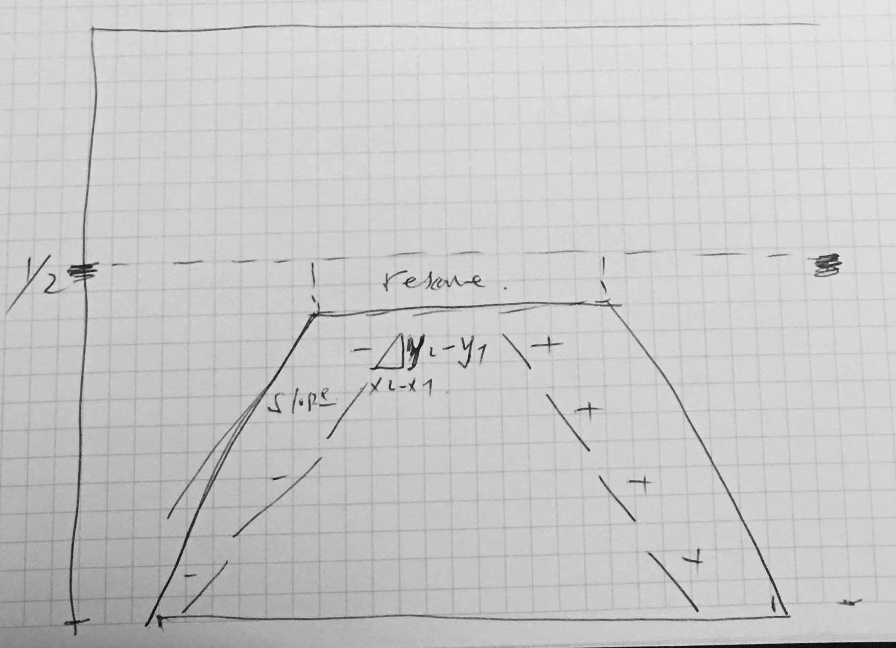

---
output:
  pdf_document: default
  html_document: default
---
**Finding Lane Lines on the Road**

The goals / steps of this project are the following:
* Make a pipeline that finds lane lines on the road
* Reflect on your work in a written report

---

### Reflection

### 1. Describe your pipeline. As part of the description, explain how you modified the draw_lines() function.

My pipeline consisted of 5 steps. 

Color images --> Gray scale images --> Gaussian blur smoothed images --> Canny function deges detection --> Hough lines drawing in the region of interest

In order to draw a single line on the left and right lanes, I modified the draw_lines() function by:
# Draw a line from the top point to the bottom point of the lane, leftlane and rightlane seperately
    # Separate single lines into leftline or rightline by their slopes
    # Get the average slope and intercept
    # Get the y_min (y_max is know)
    # For both left and right lines:
        # Get x_min and x_max values by x = (y - b) / slope, y is the y_min or             y_max, b is the intercept 
        # Draw a line from (x_min, y_min) to (x_max, y_max)

### 2. Identify potential shortcomings with your current pipeline

One potential shortcoming would be what would happen when the lane is not straight, like in the challenge video. 

Another shortcoming could be when the lane is out of the polygon defined. 

### 3. Suggest possible improvements to your pipeline

A possible improvement would be to draw the curved line in case of turning like in the challenge video. 

Another potential improvement could be to dynamically change the ROI by the region of lane found, but excluding the other hough lines. The algorithm should be able to isolate lanes from other edges. 

